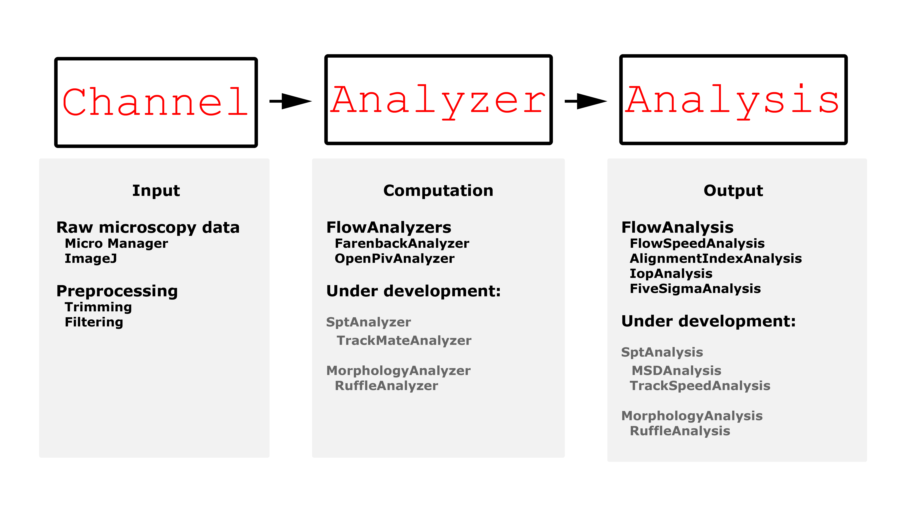

Introduction to Cellocity
=========================

A 30 second pitch
-----------------

Cellocity is a bioimage analysis tool for quantifying confluent cell layer dynamics. The main advantages of Cellocity is its ability to work on unlabeled Brightfield time lapse microscopy data, and to both quantify and visualize abstract optical flow analyses to the user.

.. figure:: _static/spinning_logo.gif
    :align: left
    :alt: Example output
    
    Figure showing simulated raw data (left), a vector field visualization (center), and a heat map encoding speeds (right).

Installing Cellocity
--------------------

Cellocity is available on the Python package index and the latest release can be installed using pip::
	
    pip install cellocity

You can also clone the Github repository if you are interested in getting the current development version of Cellocity::

    git clone https://github.com/Oftatkofta/cellocity.git cellocity
    cd cellocity
    pip install -e .

Cellocity requires Python (>3.7), tifffile (2020.5.5), python-OpenCV (4.2.0.34), OpenPIV (0.21.3), Numpy (1.18.4), Pandas (1.0.3) to function correctly. Additionally, you need Matplotlib (3.2.1) and Seaborn (0.10.1) in order to visualize the validation output. If you perform a pip install from PyPi, all dependencies will be installed automatically.

Cellocity development history
-----------------------------

Cellocity has been developed over multiple years and several projects. The nucleus was developed in `Stig Ove Bøe's <https://ous-research.no/home/boe/Group+members/10831>`_ research group at Oslo University Hospital and at the `Nanoscopy Gaustad <https://www.med.uio.no/english/research/core-facilities/advanced-light-microscopy-gaustad/>`_ imaging core facility at the University of Oslo. Many of Cellocity's core algorithm implementations and methods, such as the 5-sigma correlation length analysis, were presented in a `Nature Communications <https://www.nature.com/articles/s41467-018-05578-7>`_ publication in 2018 :cite:`Laang2018`.

The framework is currently being used and further developed as the analysis backbone for studies of microbial interactions with the gut epithelium in the `Sellin Laboratory <https://www.imbim.uu.se/research-groups/infection-and-immunity/sellin-mikael/>`_ at Uppsala University.

Cellocity backbone
------------------

Cellocity is built on top of  Christoph Gohlke's `Tifffile library <https://pypi.org/project/tifffile/>`_ and uses the ``Tifffile`` object to read input and write output files. Cellocity also relies heavily on `OpenCV <https://opencv.org/>`_ :cite:`Bradski2000` and `OpenPIV <http://www.openpiv.net/>`_ :cite:`Taylor2010` for optical flow analysis and output visualizations. `NumPy <https://numpy.org/>`_ :cite:`vanderWalt2011` is used internally for image data manipulation in the form of ``numpy.ndarrays``, and `matplotlib <https://matplotlib.org/>`_ is used to generate output plots :cite:`Hunter2007`.

Cellocity architecture
----------------------
The core element in Cellocity is the ``Channel`` object, which represents one Z-plane of one time lapse image channel. ``Channel`` objects also handle image pre-processing, such as temporal or spatial median filtering. ``Channel`` objects are given as input to ``Analyzer`` objects, which perform specific analyses on the data. ``Analyzer`` objects can then, in turn, be given to ``Analysis`` objects, which take care of performing further analyses, such as calculating the alignment index, instantaneous order parameter (:math:`{\psi}`), and correlation length.

    
    Figure showing the overall object architecture of Cellocity.

Examples of algorithms and vector field quantifications implemented
-------------------------------------------------------------------
Instantaneous Order Parameter (:math:`{\psi}`)
   :math:`{\psi}` = 1 corresponds to a perfectly uniform velocity field, where all the cells move in the same direction and with the same speed, while :math:`{\psi}` :math:`{\approx}` 0 is expected for a randomly oriented velocity field. See :cite:`Malinverno2017` for details.

Alignment Index
  The Alignment Index describes how well each vector in a vector field aligns with the average velocity vector.
  See :cite:`Malinverno2017` for further details.

5-:math:`{\sigma}` correlation length
  5-:math:`{\sigma}` correlation length is a way to measure the correlation length in large vector fields. It finds the average distance at which the direction of velocities are no longer significantly different at a level of 5 standard deviations (:math:`{\sigma}`). The algorithm was originally presented and utilized in :cite:`Laang2018`. A more detailed description can be found in the :doc:`developer`.

Examples
--------

Simple file loading example::

    from cellocity.channel import Channel
    from tifffile import Tiffile
    
    tif = Tifffile(myFile)
    channel_1 = Channel(0, tif, "channel name") #0-indexed channels, meaning ch1 in ImageJ

Simple pre-processing example::
    
    from cellocity.channel import MedianChannel
    
    #Trim Channel to frame 2-40
    channel_1.trim(2, 41)
    #3-frame gliding temporal median projection by default
    channel_1_median = MedianChannel(channel_1)

Simple optical flow calculation example::
    
    from cellocity.analysis import FarenbackAnalyzer
    
    analysis_Ch1 = FarenbackAnalyzer(channel_1_median, "um/min")
    analysis_Ch1.doFarenbackFlow()

Simple analysis data readout example::

    analysis_Ch1.doFlowsToSpeed()
    analysis_Ch1.saveSpeedCVS("/path/to/savefolder")

For more detailed examples please check out the tutorial section.

Support
-------

If something is unclear or if you are in need of support, please contact the developer by creating a new `support issue <https://github.com/Oftatkofta/cellocity/issues>`_.

References
----------
.. bibliography:: ../paper.bib
   :style: plain
   :cited:

