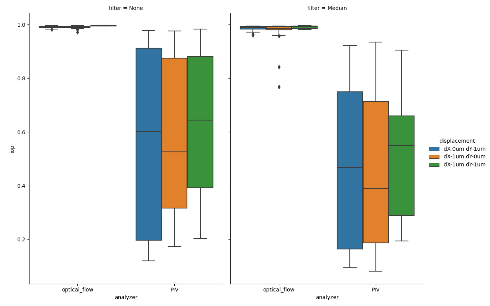
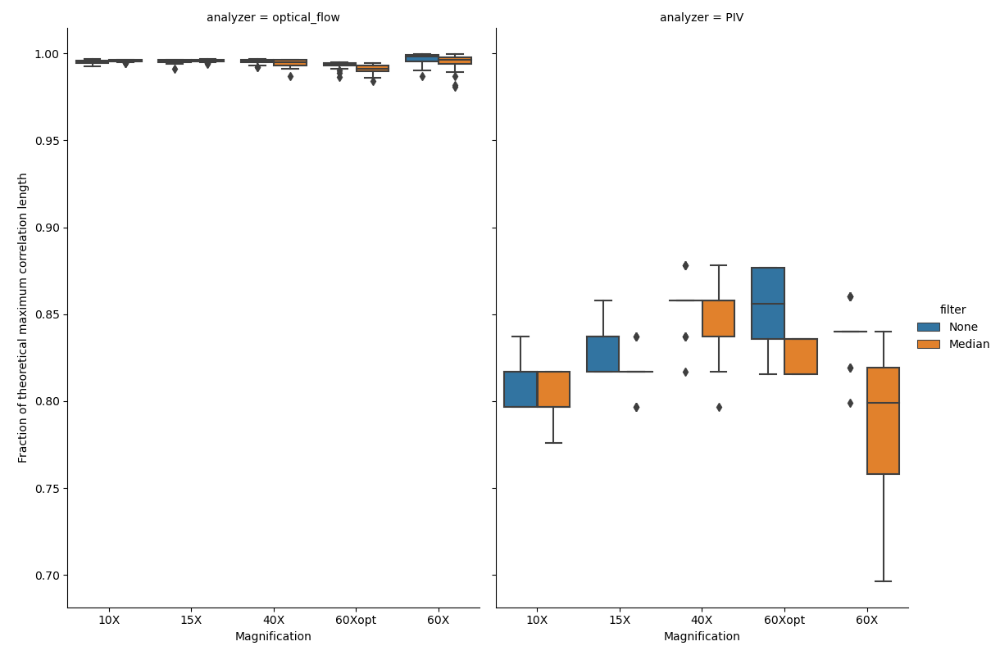
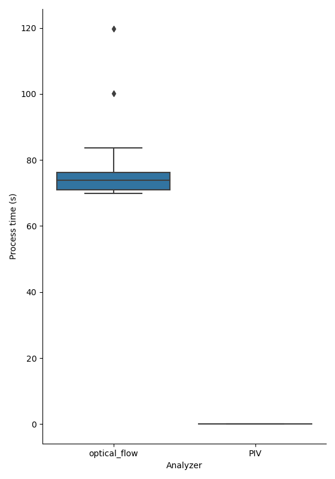

Validation of the Cellocity Software
====================================

Validation dataset
------------------

In order to validate the underlying analyzers in Cellocity we have generated a “ground truth”, real-world microscopy dataset.
The dataset was generated by translating and imaging, with DIC contrast, a fixed monolayer of primary gut epithelium on a high precision linear microscope stage, using a wide selection of magnifications.
10 images were acquired  with the stage translated 1 :math:`{\mu m}` in either the X, Y or both directions simultaneously between frames. Images were acquired on a Nikon Eclipse Ti-2 microscope, equipped with a Photometrics Prime 95B camera (1608x1608, 11 um pixel size).
The general structure of the dataset is outlined in the table below.

+---------------------------------+-----------+---------------+-----------------+--------------------+--------------------+------------------------------------------------------------+
| Objective                       | Tube lens | Total         | Pixel Size (um) | X translation (um) | Y translation (um) | Filename                                                   |
|                                 |           | magnification |                 |                    |                    |                                                            |
+=================================+===========+===============+=================+====================+====================+============================================================+
| Nikon 10X/0.45 Air Pln.Apo.Lmbd | 1X        | 10X           | 1.1235          | 0                  | 1                  | fixed_monolayer_DIC_10X_dX-0um_dY-1um_1_MMStack.ome.tif    |
+---------------------------------+-----------+---------------+-----------------+--------------------+--------------------+------------------------------------------------------------+
| Nikon 10X/0.45 Air Pln.Apo.Lmbd | 1X        | 10X           | 1.1235          | 1                  | 0                  | fixed_monolayer_DIC_10X_dX-1um_dY-0um_1_MMStack.ome.tif    |
+---------------------------------+-----------+---------------+-----------------+--------------------+--------------------+------------------------------------------------------------+
| Nikon 10X/0.45 Air Pln.Apo.Lmbd | 1X        | 10X           | 1.1235          | 1                  | 1                  | fixed_monolayer_DIC_10X_dX-1um_dY-1um_1_MMStack.ome.tif    |
+---------------------------------+-----------+---------------+-----------------+--------------------+--------------------+------------------------------------------------------------+
| Nikon 10X/0.45 Air Pln.Apo.Lmbd | 1.5X      | 15X           | 0.749           | 0                  | 1                  | fixed_monolayer_DIC_15X_dX-0um_dY-1um_1_MMStack.ome.tif    |
+---------------------------------+-----------+---------------+-----------------+--------------------+--------------------+------------------------------------------------------------+
| Nikon 10X/0.45 Air Pln.Apo.Lmbd | 1.5X      | 15X           | 0.749           | 1                  | 0                  | fixed_monolayer_DIC_15X_dX-1um_dY-0um_1_MMStack.ome.tif    |
+---------------------------------+-----------+---------------+-----------------+--------------------+--------------------+------------------------------------------------------------+
| Nikon 10X/0.45 Air Pln.Apo.Lmbd | 1.5X      | 15X           | 0.749           | 1                  | 1                  | fixed_monolayer_DIC_15X_dX-1um_dY-1um_1_MMStack.ome.tif    |
+---------------------------------+-----------+---------------+-----------------+--------------------+--------------------+------------------------------------------------------------+
| Nikon 40X/0.6 Air S.Pln.Fl.     | 1X        | 40X           | 0.286           | 0                  | 1                  | fixed_monolayer_DIC_40X_dX-0um_dY-1um_1_MMStack.ome.tif    |
+---------------------------------+-----------+---------------+-----------------+--------------------+--------------------+------------------------------------------------------------+
| Nikon 40X/0.6 Air S.Pln.Fl.     | 1X        | 40X           | 0.286           | 1                  | 0                  | fixed_monolayer_DIC_40X_dX-0um_dY-1um_1_MMStack.ome.tif    |
+---------------------------------+-----------+---------------+-----------------+--------------------+--------------------+------------------------------------------------------------+
| Nikon 40X/0.6 Air S.Pln.Fl.     | 1X        | 40X           | 0.286           | 1                  | 1                  | fixed_monolayer_DIC_40X_dX-0um_dY-1um_1_MMStack.ome.tif    |
+---------------------------------+-----------+---------------+-----------------+--------------------+--------------------+------------------------------------------------------------+
| Nikon 40X/0.6 Air S.Pln.Fl.     | 1.5X      | 60X           | 0.191           | 0                  | 1                  | fixed_monolayer_DIC_60Xopt_dX-0um_dY-1um_1_MMStack.ome.tif |
+---------------------------------+-----------+---------------+-----------------+--------------------+--------------------+------------------------------------------------------------+
| Nikon 40X/0.6 Air S.Pln.Fl.     | 1.5X      | 60X           | 0.191           | 1                  | 0                  | fixed_monolayer_DIC_60Xopt_dX-1um_dY-0um_1_MMStack.ome.tif |
+---------------------------------+-----------+---------------+-----------------+--------------------+--------------------+------------------------------------------------------------+
| Nikon 40X/0.6 Air S.Pln.Fl.     | 1.5X      | 60X           | 0.191           | 1                  | 1                  | fixed_monolayer_DIC_60Xopt_dX-1um_dY-1um_1_MMStack.ome.tif |
+---------------------------------+-----------+---------------+-----------------+--------------------+--------------------+------------------------------------------------------------+
| Nikon 60X/0.7 Air S.Pln.Fl.     | 1X        | 60X           | 0.125           | 0                  | 1                  | fixed_monolayer_DIC_60X_dX-0um_dY-1um_1_MMStack.ome.tif    |
+---------------------------------+-----------+---------------+-----------------+--------------------+--------------------+------------------------------------------------------------+
| Nikon 60X/0.7 Air S.Pln.Fl.     | 1X        | 60X           | 0.125           | 1                  | 0                  | fixed_monolayer_DIC_60X_dX-1um_dY-0um_1_MMStack.ome.tif    |
+---------------------------------+-----------+---------------+-----------------+--------------------+--------------------+------------------------------------------------------------+
| Nikon 60X/0.7 Air S.Pln.Fl.     | 1X        | 60X           | 0.125           | 1                  | 1                  | fixed_monolayer_DIC_60X_dX-1um_dY-1um_1_MMStack.ome.tif    |
+---------------------------------+-----------+---------------+-----------------+--------------------+--------------------+------------------------------------------------------------+

This dataset allowed us compare the "golden standard" of cell layer dynamics analysis, Particle Image Velocimetry (PIV) analysis, with the less frequently used Optical Flow analysis.
Our conclusion mirror what was found in [#vig]_, which is that Optical Flow analysis is indeed superior to PIV analysis, both with respect to accuracy and efficiency.
The following section will substantiate this finding. All analyses were run on a early 2020 Dell XPS 15 7590 laptop, running Windows 10.

Downloading the validation dataset
----------------------------------

The dataset has been deposited into the BioStudies database with the accession number `S-BSST461 <https://www.ebi.ac.uk/biostudies/studies/S-BSST461>`_ and can be downloaded from there.

Performing the validation on your local installation
----------------------------------------------------

All the validation figures can be re-generated on your local install by running the following code:

.. code-block:: python
	
	from cellocity import validation
	from pathlib import Path
	
	inpath = Path("path/to/S-BSST641/")
	outpath = Path("path/to/output/folder")
	
	validation.run_validation(inpath, outpath)

After some time you should have generated the 3 figures below in this chapter in your chosen output folder.

Process time
------------

.. figure:: _static/process_time_compare.png
    :align: left
    :alt: Figure comparing processing time Optical Flow vs PIV
    
    Figure showing violin plots of processing times for individual files in the test dataset. Process time is in seconds and denotes time to run either the ``OpenPivAnalyzer`` or the ``FarenbackAnalyzer`` on both a ``Channel`` and a ``MedianChannel`` object created from each file in the dataset. Each file is a 10x1608x1608 16-bit array.

Optical Flow is clearly faster to process all files by a factor of ~3-4X. Now, let's compare overall accuracy.
Since the dataset was created by translating a high precision stage on a well calibrated microscope, we know that the speed of the apparent flow is dependent on the translation distance.
In our case we translated the stage 1 :math:`{\mu m}` between images, and if we set the frame interval to 1 second, then the speed should be 1 :math:`{\mu m/s}` for the X and Y translation
and :math:`\sqrt{2} = 1.42` :math:`{\mu m/s}` for the X+Y translation.

Analysis of flow speeds
-----------------------

.. figure:: _static/avg_speed_compare.png
    :align: left
    :alt: Figure comparing average speed calculated from Optical Flow vs PIV
    
    Figure showing box plots of average speeds for each frame for each file in the test dataset. y-axis denotes the speed in :math:`{\mu m/s}`, as read out by the ``.calculateAverageSpeeds()`` method of ``FlowSpeedAnalyser``. 

Both ``Analyzers`` produce results close to the expected, but the ``OpenPivAnalyzer`` has a tendency to underestimate the speed and has greater variance.

Cell monolayers grown on loose hydrogel support, as those used in our validation dataset here, are seldom completely planar and portions are often out of focus during imaging. This phenomenon has also been captured in the analysis. If we draw a visualization of the flow generated superimposed on the background ``Channel``, we can study this phenomenon in more detail.

Qualitative vector field comparison
-----------------------------------

.. figure:: _static/40X_vector_panels_compare.png
    :align: left
    :alt: Figure comparing vector visualization from Optical Flow vs PIV
    

    Figure showing flow vector visualization of a 600x600 crop from the bottom right corner of the final frame from the 40X magnification files in the dataset. Images were generated using the ``.draw_all_flow_frames_superimposed()`` method common to all ``FlowAnalysis`` objects. Horizontal scale bar denotes a flow of 1 :math:`{\mu m/s}` .

Studying the above figure allows us to get a deeper understanding of why optical flow and PIV differ. Note that the area in the bottom right corner is not properly focused. This causes the PIV algorithm problems in accurately determining the flow, as illustrated by the inhomogeneities in the vector field.
This error can be quantified by calculating the alignment index, a measurement on how well each component vector aligns with the average flow. In our test dataset the flow should be close to completely uniform, giving an expected alignment index of 1.0.

Quantitative vector field comparison
------------------------------------

.. figure:: _static/alignment_index_compare.png
    :align: left
    :alt: Figure comparing average frame alignment index from Optical Flow vs PIV
    
    Figure showing box plots of average alignment indexes for each frame for each file in the test dataset. y-axis denotes the Alignment Index (dimensionless), as read out by the ``.getAvgAlignIdxs()`` method of ``AlignmentIndexAnalysis``.

Quantifying how well the vector field is aligned allows us to confirm our intital observation that PIV analysis does produce more variability in the direction of the flow vectors. Optical Flow generates alignment indexes very close to the expected value of 1.0, even after temporal median filtering.    

    
    Figure showing box plots of average instantaneous order parameters (iop) for each frame for each file in the test dataset. y-axis denotes the iop (dimensionless), as read out by the ``.getIops()`` method of ``IopAnalysis``.

The instantaneous order parameter is a measure of how ordered a vector field is, 0 represents a completely random field and 1 represents a comletely homogenous field, where all vectors have the same direction and magnitude. The expected value for the test data set is 1. 

.. figure:: _static/60X_diagonal_compare.gif
    :align: left
    :alt: Figure comparing vector visualization from Optical Flow vs PIV
    
    Figure showing flow vector visualization of the diagonal translation at 60X magnification. Images were generated using the ``.draw_all_flow_frames_superimposed()`` method common to all ``FlowAnalysis`` objects, ``OpenPivAnalyzer`` (left) and ``FarenbackAnalyzer`` (right). Horizontal scale bar denotes a flow of 1 :math:`{\mu m/s}` .

Lastly, let's have a look at the 5-:math:`{\sigma}` correlation length analysis. 5-:math:`{\sigma}` correlation length is a way to measure the correlation length in large vector fields. It finds the average distance at which the direction of velocities are no longer significantly different at a level of 5 standard deviations (:math:`{\sigma}`). The algorithm was originally presented and utilized in [#Laang2018]_. A more detailed description can be found in the :doc:`developer`.

    Figure showing box plots of how well the calculated 5-:math:`{\sigma}` correlation lengths agree with the theoretical maximum value. The value is expressed as a fraction of the calculated correlation length and the theoretical maximum value, which is given by the magnification. ``OpenPivAnalyzer`` data (right) and ``FarenbackAnalyzer`` data (left) with (orange) and without (blue) temporal median filtration of raw data.

Once again we see the superiority of optical flow when compared to PIV. If the 

    

    Figure showing flow vector visualization of the diagonal translation at 60X magnification. Images were generated using the ``.draw_all_flow_frames_superimposed()`` method common to all ``FlowAnalysis`` objects, ``OpenPivAnalyzer`` (left) and ``FarenbackAnalyzer`` (right). Horizontal scale bar denotes a flow of 1 :math:`{\mu m/s}` .

Optical Flow and PIV analysis of transmitted light microscopy time-lapse data is commonly used in studies of confluent cell layer dynamics phenomena, for example collective cell migration and wound healing.
This is particularly relevant for studies of primary cells, due to the difficulty in reliably labelling these for cell tracking.
To our knowledge, there has not been a systematic evaluation of different pre-processing modalities and optical flow analysis algorithms on actual real-world, non-simulated, microscopy data. We therefore anticipate that others will find this software package and the validation dataset described in this chapter useful.
 

References
----------

..  [#vig] Dhruv K. Vig, Alex E. Hamby and Charles W. Wolgemuth. On the Quantification of Cellular Velocity Fields. *Biophysical Journal*, 110:1469-1475, 2016. `doi:10.1016/j.bpj.2016.02.032. <https://doi.org/10.1016/j.bpj.2016.02.032>`_

.. [#Laang2018] Emma Lång, Anna Połeć, Anna Lång, Marijke Valk, Pernille Blicher, Alexander D. Rowe, Kim A. Tønseth, Catherine J. Jackson, Tor P. Utheim, Liesbeth M. C. Janssen, Jens Eriksson and Stig Ove Bøe. Coordinated collective migration and asymmetric cell division in confluent human keratinocytes without wounding. *Nature communications*, 1:2041-1723, 2018. `doi:10.1038/s41467-018-05578-7. <https://doi.org/10.1038/s41467-018-05578-7>`_  

