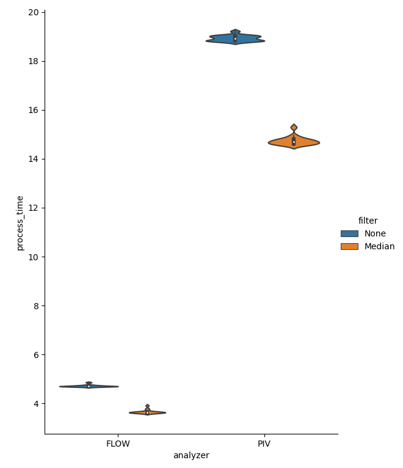
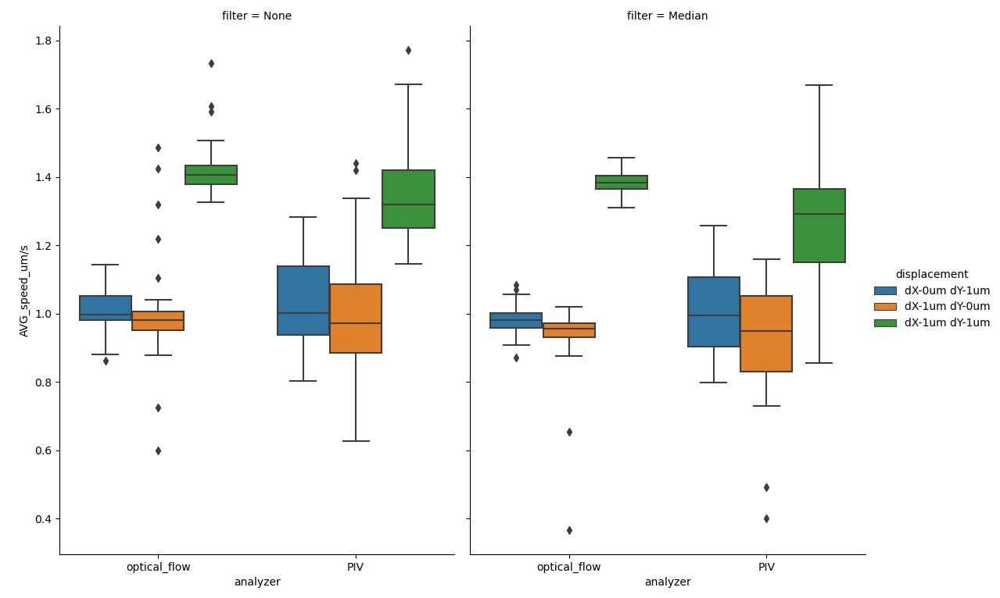
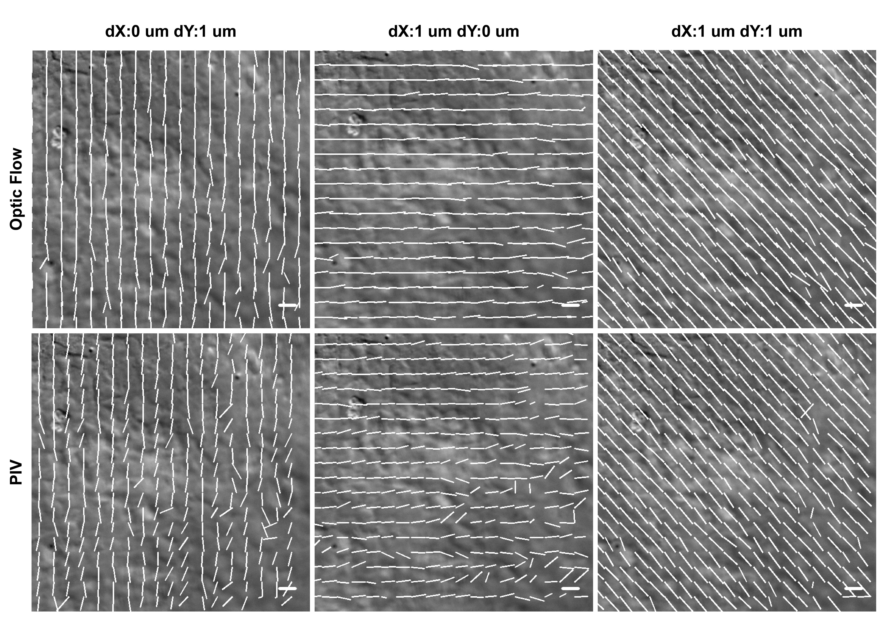
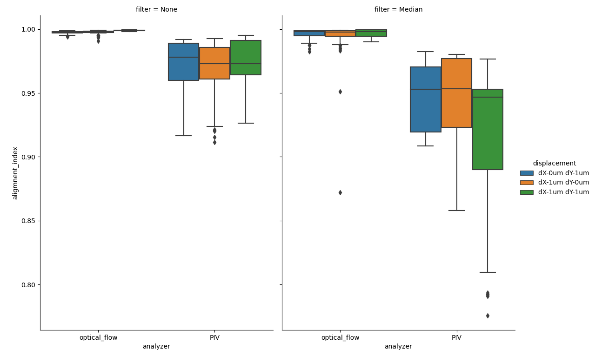

Validation of the cellocity software
====================================

In order to validate the underlying analyzers in Cellocity we have generated a “ground truth”, real-world microscopy dataset.
The dataset was generated by translating and imaging, with DIC contrast, a fixed monolayer of primary gut epithelium on a high precision linear microscope stage, using a wide selection of magnifications.
10 images were acquired  with the stage translated 1 :math:`{\mu m}` in either the X, Y or both directions simultaneously between frames. Images were acquired on a Nikon Eclipse Ti-2 microscope equipped with a Photometrics Prime 95B camera (1608x1608, 11 um pixel size).
The general structure of the dataset is outlined in the table below.

+---------------------------------+-----------+---------------+-----------------+--------------------+--------------------+------------------------------------------------------------+
| Objective                       | Tube lens | Total         | Pixel Size (um) | X translation (um) | Y translation (um) | Filename                                                   |
|                                 |           | magnification |                 |                    |                    |                                                            |
+=================================+===========+===============+=================+====================+====================+============================================================+
| Nikon 10X/0.45 Air Pln.Apo.Lmbd | 1X        | 10X           | 1.1235          | 0                  | 1                  | fixed_monolayer_DIC_10X_dX-0um_dY-1um_1_MMStack.ome.tif    |
+---------------------------------+-----------+---------------+-----------------+--------------------+--------------------+------------------------------------------------------------+
| Nikon 10X/0.45 Air Pln.Apo.Lmbd | 1X        | 10X           | 1.1235          | 1                  | 0                  | fixed_monolayer_DIC_10X_dX-1um_dY-0um_1_MMStack.ome.tif    |
+---------------------------------+-----------+---------------+-----------------+--------------------+--------------------+------------------------------------------------------------+
| Nikon 10X/0.45 Air Pln.Apo.Lmbd | 1X        | 10X           | 1.1235          | 1                  | 1                  | fixed_monolayer_DIC_10X_dX-1um_dY-1um_1_MMStack.ome.tif    |
+---------------------------------+-----------+---------------+-----------------+--------------------+--------------------+------------------------------------------------------------+
| Nikon 10X/0.45 Air Pln.Apo.Lmbd | 1.5X      | 15X           | 0.749           | 0                  | 1                  | fixed_monolayer_DIC_15X_dX-0um_dY-1um_1_MMStack.ome.tif    |
+---------------------------------+-----------+---------------+-----------------+--------------------+--------------------+------------------------------------------------------------+
| Nikon 10X/0.45 Air Pln.Apo.Lmbd | 1.5X      | 15X           | 0.749           | 1                  | 0                  | fixed_monolayer_DIC_15X_dX-1um_dY-0um_1_MMStack.ome.tif    |
+---------------------------------+-----------+---------------+-----------------+--------------------+--------------------+------------------------------------------------------------+
| Nikon 10X/0.45 Air Pln.Apo.Lmbd | 1.5X      | 15X           | 0.749           | 1                  | 1                  | fixed_monolayer_DIC_15X_dX-1um_dY-1um_1_MMStack.ome.tif    |
+---------------------------------+-----------+---------------+-----------------+--------------------+--------------------+------------------------------------------------------------+
| Nikon 40X/0.6 Air S.Pln.Fl.     | 1X        | 40X           | 0.286           | 0                  | 1                  | fixed_monolayer_DIC_40X_dX-0um_dY-1um_1_MMStack.ome.tif    |
+---------------------------------+-----------+---------------+-----------------+--------------------+--------------------+------------------------------------------------------------+
| Nikon 40X/0.6 Air S.Pln.Fl.     | 1X        | 40X           | 0.286           | 1                  | 0                  | fixed_monolayer_DIC_40X_dX-0um_dY-1um_1_MMStack.ome.tif    |
+---------------------------------+-----------+---------------+-----------------+--------------------+--------------------+------------------------------------------------------------+
| Nikon 40X/0.6 Air S.Pln.Fl.     | 1X        | 40X           | 0.286           | 1                  | 1                  | fixed_monolayer_DIC_40X_dX-0um_dY-1um_1_MMStack.ome.tif    |
+---------------------------------+-----------+---------------+-----------------+--------------------+--------------------+------------------------------------------------------------+
| Nikon 40X/0.6 Air S.Pln.Fl.     | 1.5X      | 60X           | 0.191           | 0                  | 1                  | fixed_monolayer_DIC_60Xopt_dX-0um_dY-1um_1_MMStack.ome.tif |
+---------------------------------+-----------+---------------+-----------------+--------------------+--------------------+------------------------------------------------------------+
| Nikon 40X/0.6 Air S.Pln.Fl.     | 1.5X      | 60X           | 0.191           | 1                  | 0                  | fixed_monolayer_DIC_60Xopt_dX-1um_dY-0um_1_MMStack.ome.tif |
+---------------------------------+-----------+---------------+-----------------+--------------------+--------------------+------------------------------------------------------------+
| Nikon 40X/0.6 Air S.Pln.Fl.     | 1.5X      | 60X           | 0.191           | 1                  | 1                  | fixed_monolayer_DIC_60Xopt_dX-1um_dY-1um_1_MMStack.ome.tif |
+---------------------------------+-----------+---------------+-----------------+--------------------+--------------------+------------------------------------------------------------+
| Nikon 60X/0.7 Air S.Pln.Fl.     | 1X        | 60X           | 0.125           | 0                  | 1                  | fixed_monolayer_DIC_60X_dX-0um_dY-1um_1_MMStack.ome.tif    |
+---------------------------------+-----------+---------------+-----------------+--------------------+--------------------+------------------------------------------------------------+
| Nikon 60X/0.7 Air S.Pln.Fl.     | 1X        | 60X           | 0.125           | 1                  | 0                  | fixed_monolayer_DIC_60X_dX-1um_dY-0um_1_MMStack.ome.tif    |
+---------------------------------+-----------+---------------+-----------------+--------------------+--------------------+------------------------------------------------------------+
| Nikon 60X/0.7 Air S.Pln.Fl.     | 1X        | 60X           | 0.125           | 1                  | 1                  | fixed_monolayer_DIC_60X_dX-1um_dY-1um_1_MMStack.ome.tif    |
+---------------------------------+-----------+---------------+-----------------+--------------------+--------------------+------------------------------------------------------------+

This dataset allowed us compare the "gold standard" of cell cynamics analysis, Particle Image Velocimetry (PIV) analysis with the lesser-used optical flow analysis.
Our conclusion mirror what was found in :cite:`Vig2016`, which is that optical flow analysis is indeed superior to PIV analysis in both accuracy and efficiency.
The following section will substantiate this finding. All analysis were run on a early 2020 Dell XPS 15 7590 laptop running Windows 10. The dataset has been deposited in to the BioStudies database with the accession number `S-BSST461 <https://www.ebi.ac.uk/biostudies/studies/S-BSST461>`_ and can be downloaded from there.

    
    Figure showing violin plots of processing times for indivitual files in the test dataset. Process time is in seconds and denotes time to run either the ``OpenPivAnalyzer`` or the ``FarenbackAnalyzer`` on both a ``Channel`` and a ``MedianChannel`` object created from each file in the dataset. Each file is a 10x1608x1608 16-bit array.
	
Optical flow is clearly faster to process all files by a factor of ~3X. Now, let's compare overall accuracy.
Since the dataset was created by translating a high precision stage on a well calibrated microscope, we know that the speed of the apparent flow is dependent on the translaton distance.
In our case we translated the stage 1 :math:`{\mu m}` between images, and if we set the frame interval to 1 second, then the speed should be 1 :math:`{\mu m/s}` for the X and Y translation
and :math:`\sqrt{2} = 1.42` :math:`{\mu m/s}` for the X+Y translation.

    
    Figure showing box plots of average speeds for each frame for each file the test dataset. y-axis denotes the speed in :math:`{\mu m/s}`, as read out by the ``.calculateAverageSpeeds()`` method of ``FlowSpeedAnalyser``. 
	
Both ``Anlyzers`` produce results close to the expected, but the ``OpenPivAnalyzer`` has a tendency to underestimate the speed and has greater variance.

Monolayers growing on hydrogel are seldom completely planar and portions are often out of focus during imaging. This phenomenon has also been captured in the dataset. If we draw a visulaization of the flow generated superimposed on the background ``Channel`` we can study this phenomenon in more detail.
	

    
    Figure showing flow vector visualization of a 600x600 crop from the bottom right corner of the final frame from the 40X magnification files in the dataset. Images were generated using the ``.draw_all_flow_frames_superimposed()`` method common to all ``FlowAnalysis`` objects. Horizontal scale bar denotes a flow of 1 :math:`{\mu m/s}` .

Studying the above figure allows us to get a deeper understanding of why optical flow and PIV differ. Note that the area in the bottom right corner is not properly focused, this causes the PIV algorithm some problem in accurately determining the flow, as illustrated by the inhomogenities in the vector field.
This error can be quantified by calculating the alignment index, a measurement on how well each component vector aligns with the average flow. In our test data the flow should be close to completely uniform, giving an expected alignment index of 1.0.

    
    Figure showing box plots of average alignment index for each frame for each file the test dataset. y-axis denotes the Alignment Index (dimensionless), as read out by the ``.getAvgAlignIdxs()`` method of ``AlignmentIndexAnalysis``.

Quantifying how well the vector field is aligned allows us to confirm our intital observation that PIV analysis does produce more variability on the direction of the flow vectors. Optical flow gererates alignment indexes very close to the expected value of 1.0, even after temporal median filtering.    

.. figure:: _static/60X_diagonal_compare.gif
    :align: left
    :alt: Figure comparing vector visulalization from Optical Flow vs PIV
    
    Figure showing flow vector visualization of the diagonal translation at 60X magnification. Images were generated using the ``.draw_all_flow_frames_superimposed()`` method common to all ``FlowAnalysis`` objects, ``OpenPivAnalyzer`` (left) and ``FarenbackAnalyzer`` (right). Horizontal scale bar denotes a flow of 1 :math:`{\mu m/s}` .

Optical flow and PIV analysis of transmitted light microscopy time-lapse data is commonly performed in the study of confluent cell layer dynamics phenomena, such as collective cell migration and wound healing.
This is particularly relevant for studies of primary cells, due to the difficulty in reliably labelling these for cell tracking.
To our knowledge, there has not been a evaluation of different pre-processing modalities and optical flow analysis algorithms on real-world non-simulated microscopy data and we hope that others will find this software package and dataset useful.

 

References
----------
.. bibliography:: bibliography.bib
   :style: plain
   :cited: